# Personal Finance App - Architecture Diagrams

## Table of Contents
1. [High-Level System Overview](#1-high-level-system-overview)
2. [Mid-Level Component Architecture](#2-mid-level-component-architecture)
3. [Low-Level Flow Diagrams](#3-low-level-flow-diagrams)
4. [Data Lineage](#4-data-lineage)
5. [Class Structure](#5-class-structure)
6. [Sequence Diagrams](#6-sequence-diagrams)

---

## 1. High-Level System Overview

### 1.1 Complete System Architecture

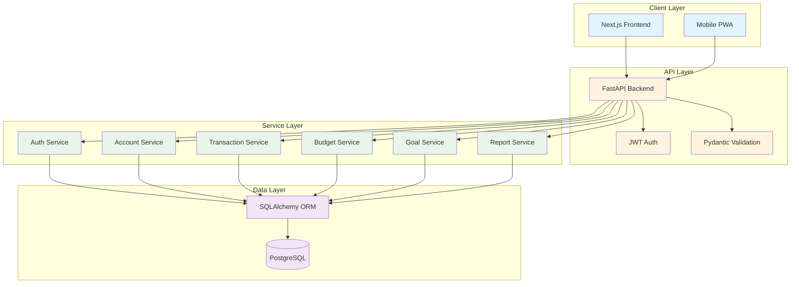

### 1.2 Simplified Architecture

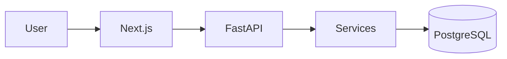

---

## 2. Mid-Level Component Architecture

### 2.1 API Endpoints Structure

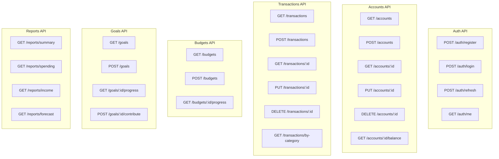

### 2.2 Frontend Component Architecture

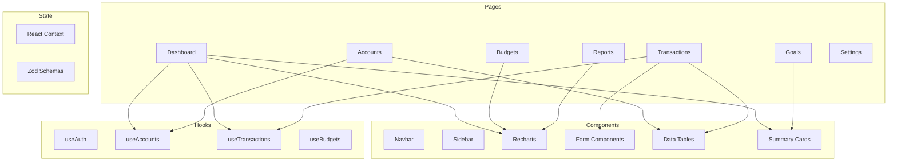

### 2.3 Database Schema Overview

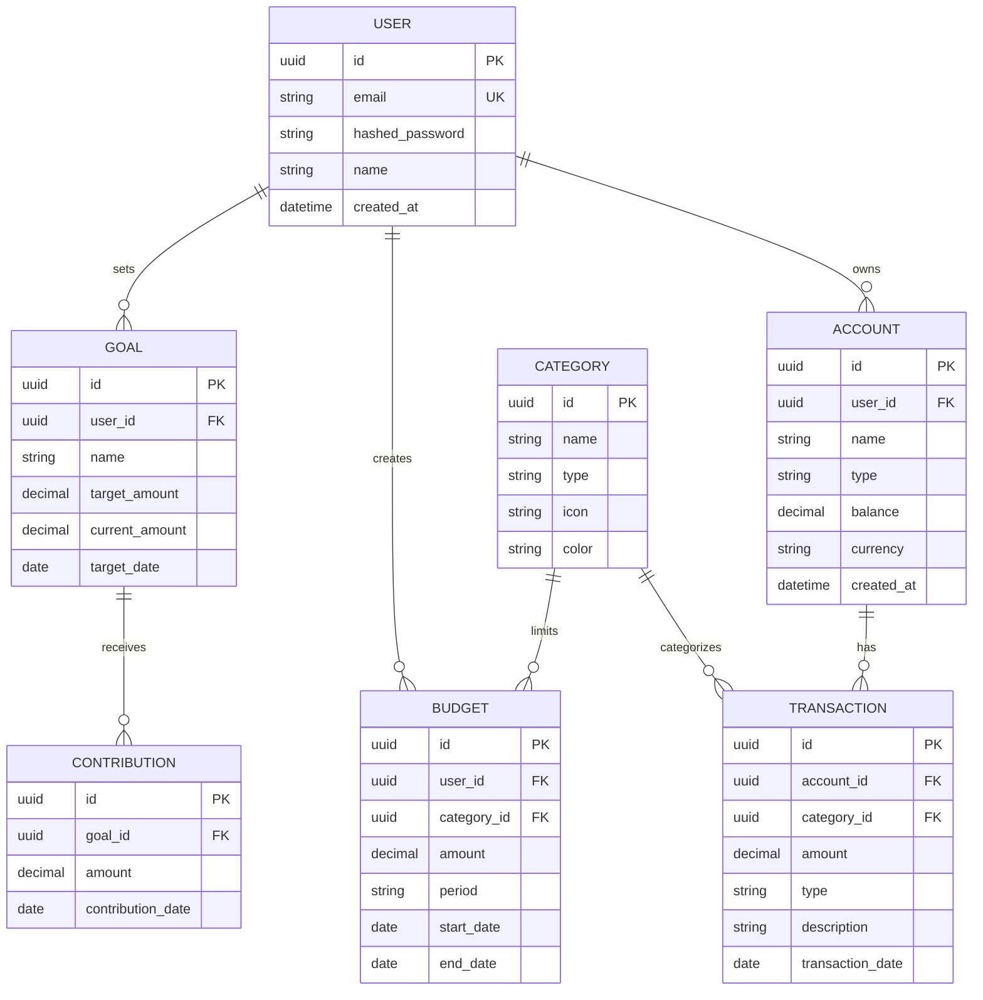

---

## 3. Low-Level Flow Diagrams

### 3.1 Request Flow: Controller to Database

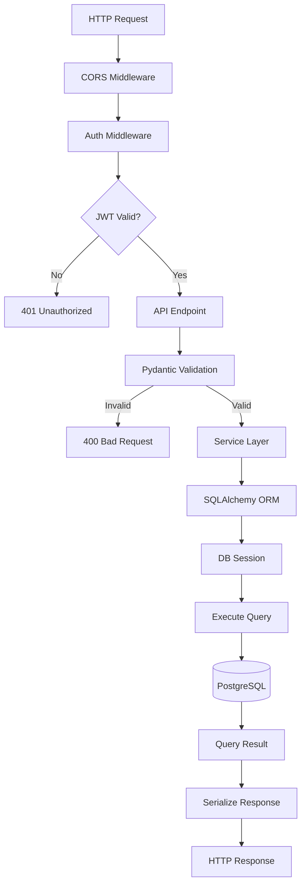

### 3.2 Transaction Creation Flow

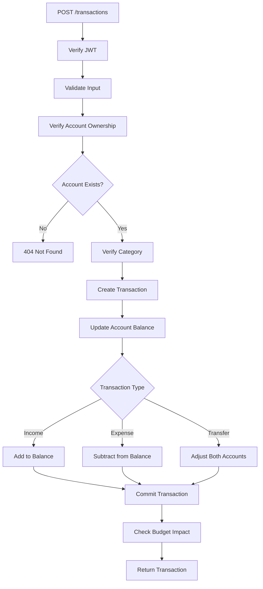

### 3.3 Budget Progress Calculation Flow

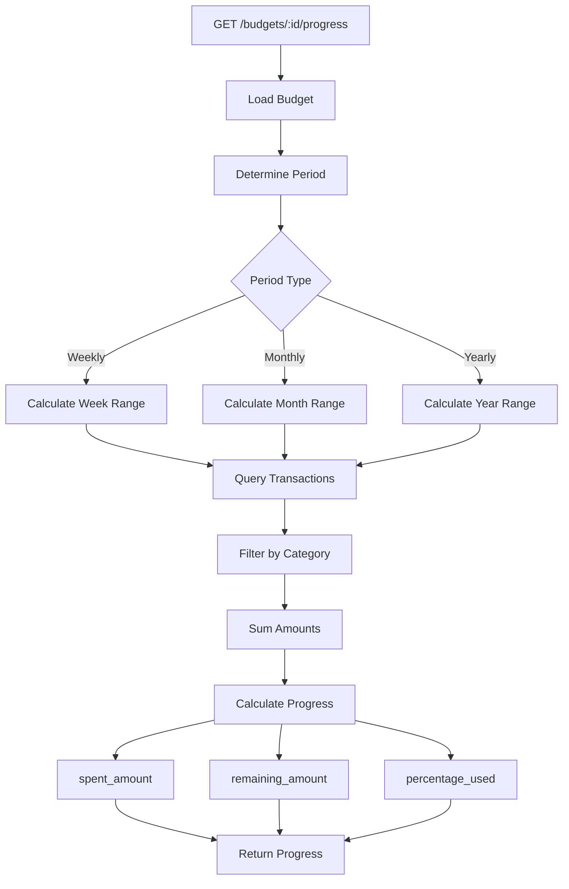

---

## 4. Data Lineage

### 4.1 Transaction Data Lineage

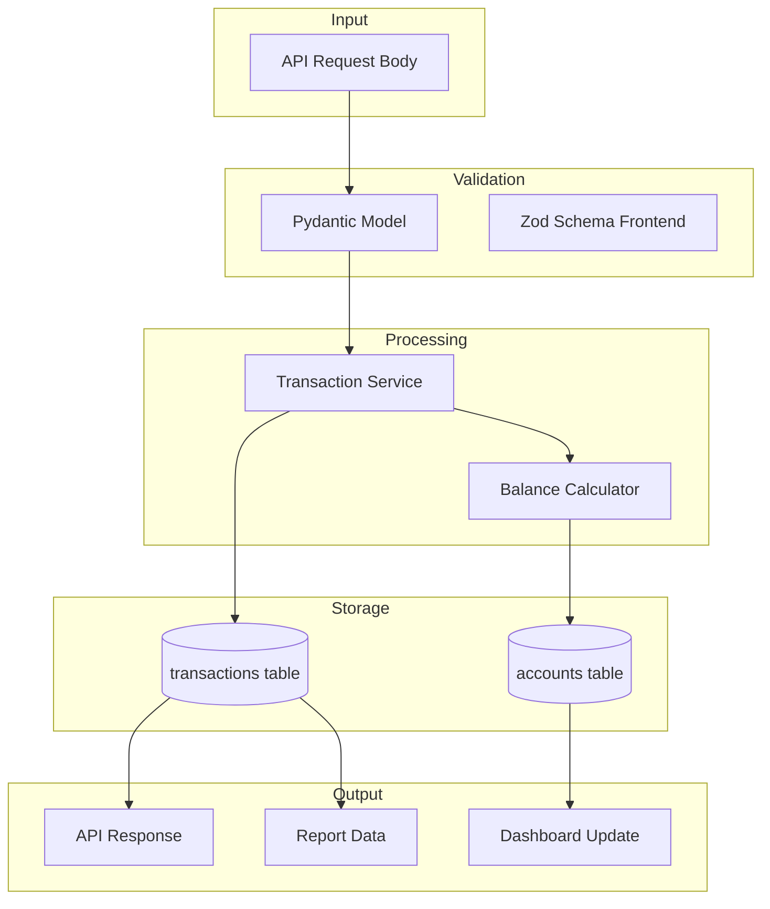

### 4.2 Budget Tracking Data Lineage

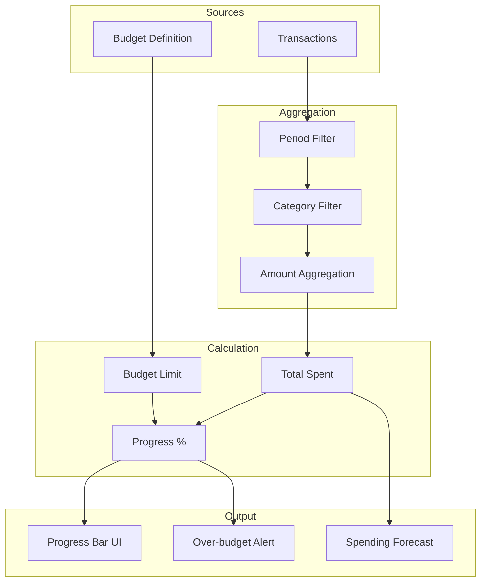

---

## 5. Class Structure

### 5.1 Backend Models

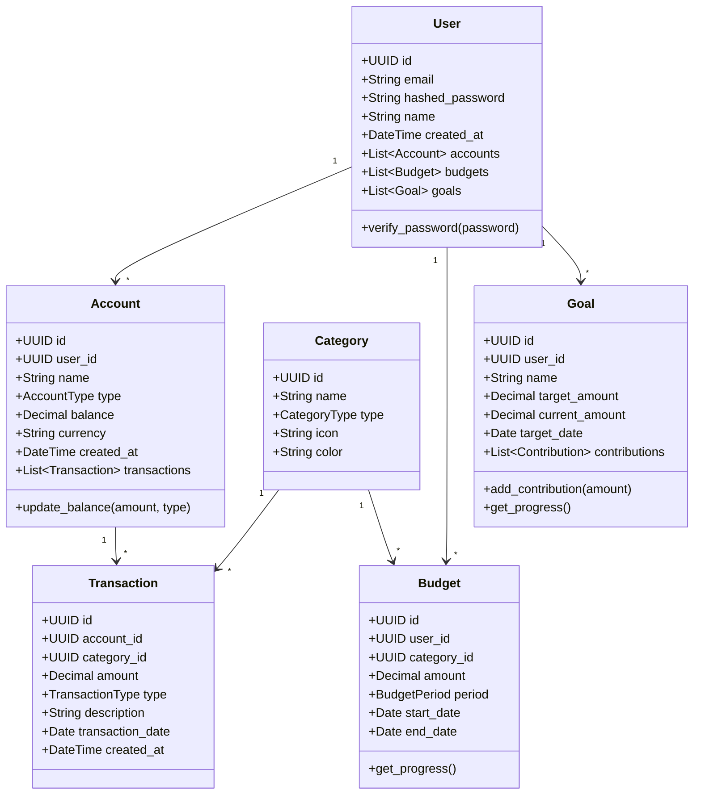

### 5.2 Service Layer Classes

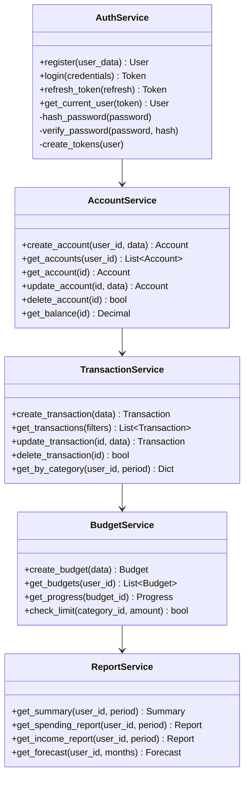

---

## 6. Sequence Diagrams

### 6.1 User Registration Flow

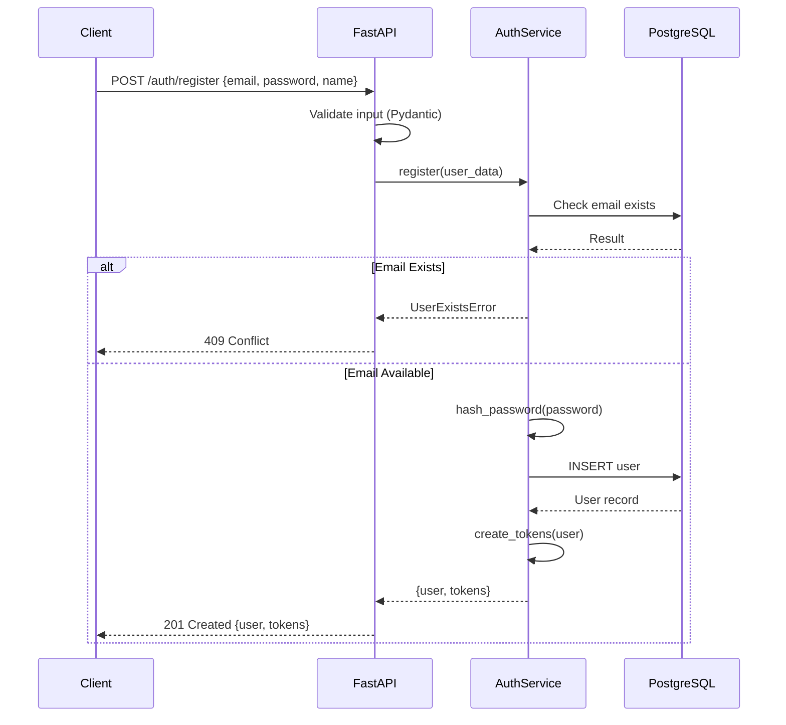

### 6.2 Transaction Creation Flow

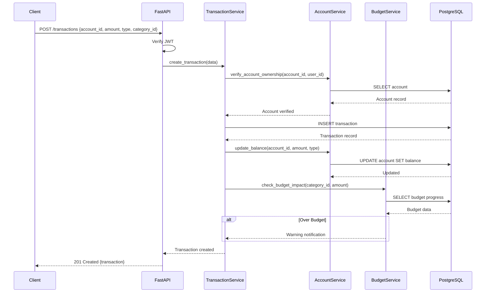

### 6.3 Dashboard Data Loading Flow

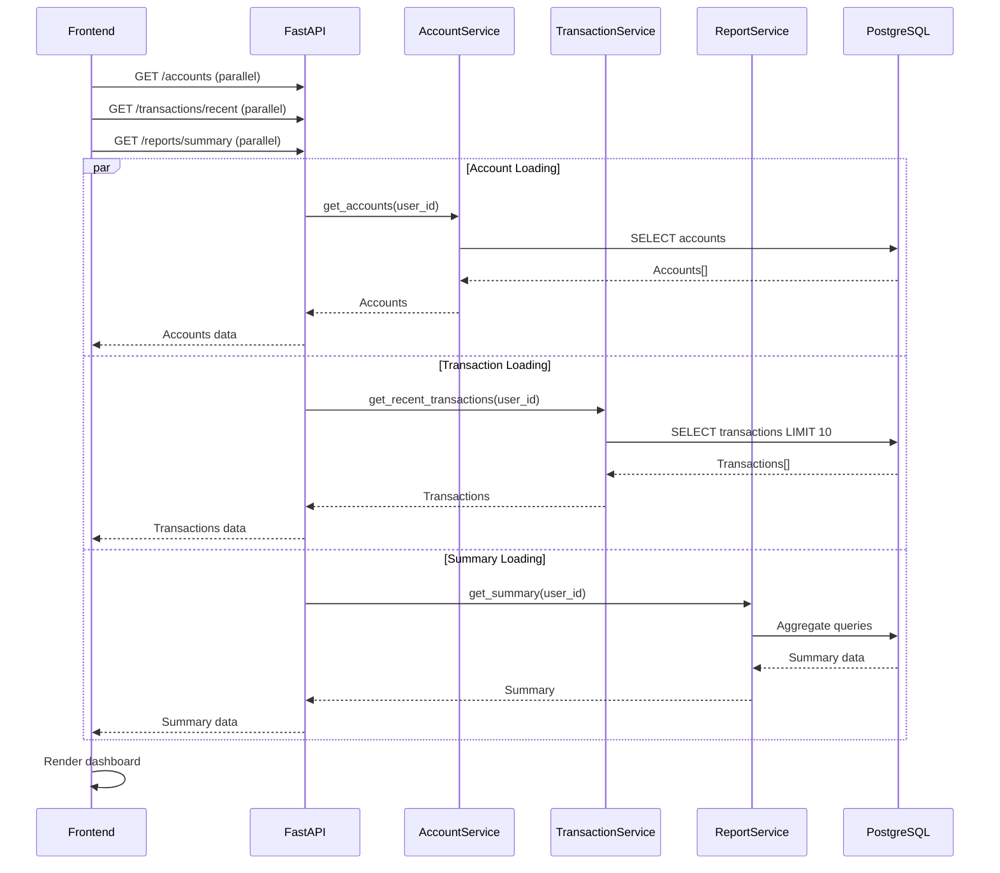

### 6.4 Expense Forecast Flow

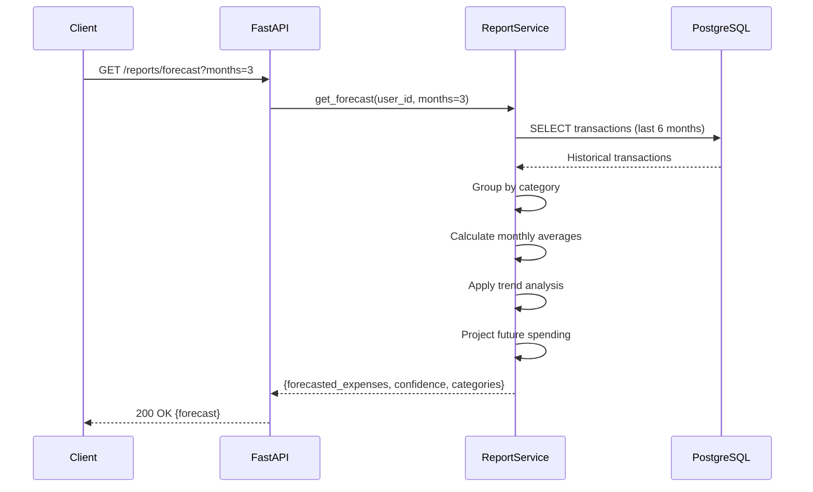

---

## 7. Unified System Map

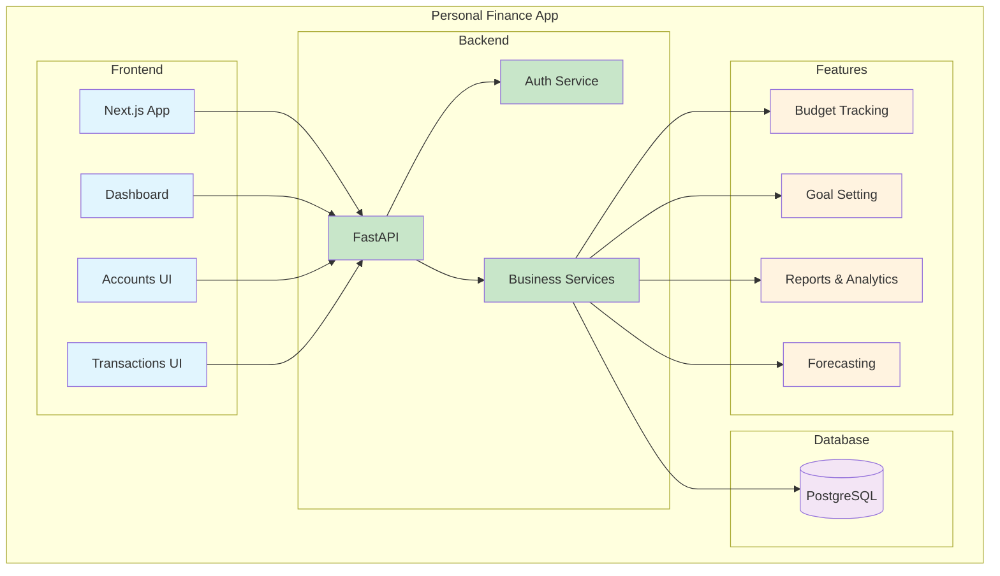

---

## Usage

View these diagrams in:
- GitHub/GitLab markdown preview
- VS Code with Mermaid extension
- [Mermaid Live Editor](https://mermaid.live/)
