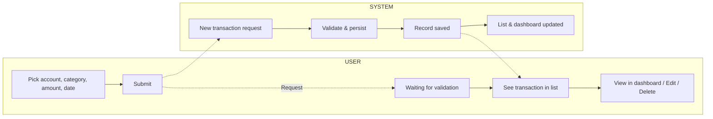
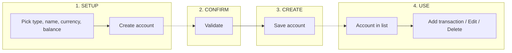

# Nexus — User flows (swimlane style)

This document describes key user journeys in Nexus using a **stage-based, swimlane** flow (User vs System), similar to a ride-sharing request flow. Use these for UX consistency, state design, and implementation reference.

---

## 1. Add transaction flow

**Stages:** 1. ENTER → 2. VALIDATE → 3. SAVE → 4. POST-SAVE

| Lane    | 1. ENTER           | 2. VALIDATE      | 3. SAVE        | 4. POST-SAVE        |
|---------|--------------------|------------------|----------------|---------------------|
| **USER**   | Pick account, category, amount, date, type (income/expense) | Waiting for validation | —              | See transaction in list; optional **Edit** / **Delete** |
| **USER**   | **Submit**         | —                | —              | **View in dashboard** |
| **SYSTEM** | —                  | Validate & persist | Record saved   | List updated; dashboard summary refreshed |

- **Request:** User submits form → System receives new transaction.
- **Accepted:** Validation passes → record saved.
- **Finished:** User sees updated list and dashboard.

---

## 2. Add account flow

**Stages:** 1. SETUP → 2. CONFIRM → 3. CREATE → 4. USE

| Lane    | 1. SETUP                | 2. CONFIRM   | 3. CREATE   | 4. USE              |
|---------|-------------------------|-------------|-------------|---------------------|
| **USER**   | Pick account type (checking, savings, credit card, etc.) and enter name, currency, initial balance | Review details | —          | Account appears in list; **Add transaction** / **Edit** / **Delete** |
| **USER**   | **Create account**      | —           | —           | **Go to dashboard** |
| **SYSTEM** | —                        | Validate    | Create account | Return account; refresh accounts list |

- **Request:** User confirms → System creates account.
- **Accepted:** Account created → appears in Accounts and dashboard.
- **Finished:** User can use account in transactions and reports.

---

## 3. Set budget & track spending flow

**Stages:** 1. DEFINE → 2. SET LIMIT → 3. ACTIVE → 4. REVIEW

| Lane    | 1. DEFINE         | 2. SET LIMIT   | 3. ACTIVE           | 4. REVIEW              |
|---------|-------------------|----------------|---------------------|------------------------|
| **USER**   | Pick category (or group) and period (monthly, etc.) | Enter budget amount | See budget in list; spending updates from transactions | View spent vs budget; **Edit** or **Delete** budget |
| **USER**   | **Set budget**     | —              | —                   | **View reports**      |
| **SYSTEM** | —                 | Validate & save | Aggregate spending for period | Compute progress; show in dashboard and reports |

- **Request:** User sets budget → System saves.
- **Accepted:** Budget active; spending calculated from transactions.
- **Finished:** User reviews progress and can adjust or archive.

---

## 4. Savings goal flow

**Stages:** 1. DEFINE GOAL → 2. COMMIT → 3. TRACK → 4. COMPLETE

| Lane    | 1. DEFINE GOAL      | 2. COMMIT    | 3. TRACK             | 4. COMPLETE           |
|---------|---------------------|-------------|----------------------|----------------------|
| **USER**   | Enter goal name, target amount, target date, optional icon | Review and confirm | See progress (current vs target); add contributions | Goal reached or adjusted; **Mark complete** / **Edit** |
| **USER**   | **Create goal**     | —           | —                    | **Celebrate** / **Set new goal** |
| **SYSTEM** | —                   | Save goal   | Update progress from linked transactions or manual contributions | Mark complete; update dashboard |

- **Request:** User creates goal → System saves.
- **Accepted:** Goal active; progress computed.
- **Finished:** User sees completion or continues tracking.

---

## 5. Auth flow (sign up / sign in)

**Stages:** 1. ENTER → 2. SUBMIT → 3. VERIFY → 4. SESSION

| Lane    | 1. ENTER           | 2. SUBMIT   | 3. VERIFY      | 4. SESSION          |
|---------|-------------------|-------------|----------------|---------------------|
| **USER**   | Enter credentials (register: email, username, password; login: username, password) | **Sign up** / **Sign in** | Waiting for response | Redirect to dashboard; Guest badge removed |
| **SYSTEM** | —                 | Receive request | Validate; issue tokens (access + refresh) | Return user + tokens; frontend stores tokens |

- **Request:** User submits → System validates.
- **Accepted:** Tokens issued → User is authenticated.
- **Finished:** User lands on dashboard (authenticated or guest).

---

## Mermaid: Transaction flow (swimlane-style)

Below is the **Add transaction** flow in Mermaid so it can be rendered in GitHub or any Mermaid viewer.

---

## Mermaid: Add account flow (stages)

---

## How to use these flows

- **Frontend:** Map each stage to routes and components (e.g. transaction form → loading → success → list/dashboard).
- **Backend:** Align API endpoints and responses with the SYSTEM lane (validate → persist → return).
- **State:** Use the stages to define clear UI state (e.g. `idle | submitting | success | error`) and avoid ambiguous “in between” states.
- **Copy/UX:** Use the same action labels (e.g. **Submit**, **Create account**, **Set budget**) in the app so the UI matches the flow doc.

Reference: `docs/PHASES.md` for phase scope and `docs/API_SPEC.md` for API details.
